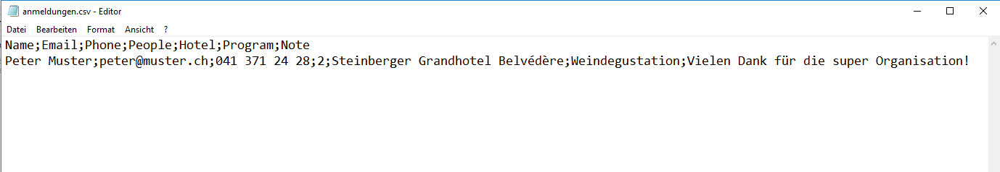

# Anmeldungen speichern

Nutze als Basis für diese Aufgabe deine Lösung zum Anmelde-Formular für den Kundenevent aus der vorherigen Aufgabe. 

## Aufgabenstellung

Erweitere dein PHP-Script, so dass beim Absenden des Formulares nach erfolgreicher Validierung, alle Daten in eine CSV-Datei abgespeichert werden.

### Lösungsschritte

#### Schritt 1 

Erstelle in deinem `htdocs` Verzeichnis einen neuen Ordner `daten`. In diesem Ordner werden wir später eine Datei anlegen, in die wir die über das Formular getätigten Anmeldungen speichern.

#### Schritt 2

Programmiere an der Stelle, wo die Erfolgsmeldung _«Anmeldung erfolgreich»_ ausgegeben wird, den PHP-Code, der die übermittelten Daten in eine Text-Datei im eben erstellten Ordner abspeichert. 

Exisitiert die Datei noch nicht, muss sie erstellt werden. Existiert sie jedoch bereits, dann müssen die neu übermittelten Anmeldungsdaten jeweils am Ende der Datei angefügt werden **ohne bereits bestehende Anmeldungen zu überschreiben!** 

Tipp: Schau dir in der PHP-Dokumentation die Funktionen [fopen](http://php.net/manual/de/function.fopen.php) und [fputcsv](https://www.php.net/manual/en/function.fputcsv.php) genauer an.

#### Schritt 3

Die Daten sollen gemäss dem **CSV-Format** strukturiert abgelegt werden. Die  Datei soll einen sprechenden Namen und die Dateiendung .csv haben, z.B. `anmeldungen.csv`.

> Das Dateiformat CSV steht für  **C**omma-**S**eparated **V**alues (seltener auch: Character-Separated Values) und beschreibt den Aufbau einer Textdatei zur Speicherung oder zum Austausch einfach strukturierter Daten. Die Dateinamenserweiterung lautet `.csv`. 

Das Csv-Format sieht vor, dass einige Zeichen innerhalb der Textdatei eine Sonderfunktion zur Strukturierung der Daten haben. Wir verwenden die folgenden Sonderzeichen:  

* Den Zeilenumbruch `\n` zur Trennung der Datensätze (Records, Tupel)
* Den Strichpunkt `;` zur Trennung der Datenfelder (Spalten) 

Unsere Csv-Datei soll ausserdem eine Kopfzeile (Header-Record) enthalten, welche die Spaltennamen repräsentieren. 



 Das Beispiel oben zeigt den Inhalt einer Csv-Datei mit einer Kopfzeile und einem Datensatz. Jede weitere Anmeldung, die über das Formular eintrifft soll in dieser Datei zu einem neuen Datensatz führen.

#### Schritt 4

Sobald du die neue Funktion fertig programmiert hast, kannst du überprüfen, ob dein Code korrekt funktioniert, indem du die untenstehenden Testfälle ausführst. 

Lösche die Csv-Datei `Daten/anmeldungen.csv` bevor du mit den Testfällen beginnst. 

**Testfall 1**

--- 

Öffne das Formular im Browser und gib folgende Daten ein.

* Name: ```Peter Muster```
* Email: ```peter@muster.ch``` 
* Telefon: ```041 371 24 24```
* Unterkunft (Anzahl Personen): ```2``` 
* Hotel: ```Steinberberger Grandhotel``` 
* Individuelles Programm: ```Billardturnier``` 
* Bemerkung: ```Hallo, ich freue mich! Gruss, Peter```

Schicke die Anmeldung ab, indem du den «Anmelden»-Button klickst.

Überprüfe das Resultat:

 * Die CSV-Datei `daten/anmeldunden.csv` wurde erstellt. 
 * Die Kopfzeile (Spaltennamen) in der Datei wurde korrekt erstellt. 
 * Die eingegebenen Daten aus dem Anmeldeformular wurden in der Datei auf der zweiten Zeile gespeichert.
 * Öffne die Csv-Datei mit Excel: alle Daten befinden sich in den richtigen Spalten. 

 **Testfall 2**

--- 

Gehe zurück zum Formular und gib die gleichen Daten ein wie bei Testfall 1, ausser bei der Bemerkung, wo du folgenden Text eingibst (`;` statt `,`). 

* Bemerkung: ```Hallo; ich freue mich! Gruss; Peter```

Schicke die Anmeldung ab, indem du den «Anmelden»-Button klickst.

Überprüfe das Resultat:

 * Die Daten aus Testfall 1 (Kopfzeile und Anmeldung) sind immer noch in der Datei `Daten/anmeldungen.csv` vorhanden (wurden nicht überschrieben).  
 * Die neue Anmeldung wurde am Ende der Csv-Datei (auf der dritten Zeile) angefügt.
 * Öffne die Csv-Datei mit Excel: alle Daten befinden sich in den richtigen Spalten. 

 **Testfall 3**

--- 

Gehe zurück zum Formular und gib die gleichen Daten ein wie bei Testfall 1, ausser bei der Bemerkung, wo du folgenden Text eingibst (mit Zeilenumbrüchen): 

* Bemerkung: 
```
Hallo 
   
Freue mich! 
   
Gruss, Peter
```

Schicke die Anmeldung ab, indem du den «Anmelden»-Button klickst.

Überprüfe das Resultat:

 * Die Daten aus den Testfällen 1 und 2  (Kopfzeile und die 2 Anmeldungen) sind immer noch in der Datei `Daten/anmeldungen.csv` vorhanden.  
 * Die Csv-Datei umfasst jetzt 3 Zeilen (Kopfzeile plus 2 Anmeldungen).
 * Öffne die Csv-Datei mit Excel: alle Daten befinden sich in den richtigen Spalten. 

## Musterlösung

Mögliche Lösungen zu der Aufgabe werden dir vom Kursleiter bereitgestellt. Natürlich ist die Funktionalität des Scripts entscheidend, nicht der Code dazu.
