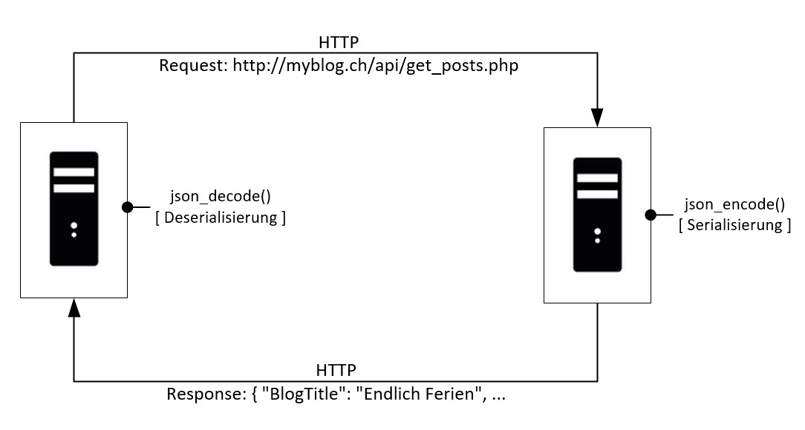

# Blog

Dein Auftrag ist es, ein Blog zu erstellen. Die Blog-Beiträge, die durch den Blogger erstellt werden, können von den Besuchern des Blogs gelesen werden.

## Anforderungen

Die Anforderungen an den Blog, d.h. welche Funktionen der Blog für den Benutzer anbieten soll, sind nachfolgend aufgeführt. Diese Anforderungen sind priorisiert:

- 1 = must
- 2 = should
- 3 = nice to have

Achte darauf, dass du zuerst die Anforderungen mit der höchsten Priorität erfüllst und erst am Schluss, wenn du noch Zeit hast, die tiefer priorisierten und damit nicht ganz so wichtigen Funktionen ausprogrammierst. 

| Nr   | Beschreibung                                                                                                                                                        | Prio |
|------|---------------------------------------------------------------------------------------------------------------------------------------------------------------------|------|
| A001 | Als Benutzer will ich Blog-Beiträge lesen können.                                                                                                                   |   1  |
| A002 | Als Blogger will ich Blog-Beiträge schreiben können.                                                                                                                |   1  |
| A003 | Zu jedem Blog-Beitrag sollen der Name des Bloggers sowie Erstelldatum/-zeit angezeigt werden.                                                                       |   1  |
| A004 | Als Benutzer will ich eine Liste mit Links zu den Blogs meiner BLJ-Kollegen sehen.                                                                                  |   1  |
| A005 | Als Blogger will ich Bilder aus dem Internet verlinken können, um meine Beiträge interessanter zu machen.                                                           |   1  |
| A006 | Als BLJ-Coach will ich, dass die Link-Liste zu den Blogs der BLJ-Lernenden (siehe A004) zentral abgelegt und dynamisch erstellt wird.                               |   2  |
| A007 | Als Benutzer will ich einen Blog-Beitrag bewerten können.                                                                                                           |   2  |
| A008 | Als Blogger will ich mich einloggen, um Blog-Beiträge zu schreiben, damit niemand in meinem Namen bloggen kann.                                                     |   2  |
| A009 | Als Benutzer will ich mich registrieren können, um als Blogger eigene Beiträge schreiben zu können.                                                                 |   2  |
| A010 | Als Blogger will ich, das mein Passwort verschlüsselt in der Datenbank abgelegt wird.                                                                               |   3  |
| A011 | Als Blogger will ich mein Passwort ändern können.                                                                                                                   |   3  |
| A012 | Als Benutzer will ich auf einen Blog-Beitrag antworten können (Kommentarfunktion).                                                                                  |   3  |
| A013 | Als Blogger will ich, dass der Kommentar eines Benutzers erst dann freigeschaltet wird, wenn der Benutzer seine E-Mail Adresse verifiziert hat (Aktivierungs-Link). |   3  |
| A014 | Als Blog-Entwickler will ich, dass andere Entwickler alle Beiträge meines Blogs über eine JSON-Schnittstelle abrufen können.                                        |   3  |
| A015 | Als Benutzer will ich auch die Blog-Beiträge aller anderen BLJ-Blogs sehen. Diese werden über die JSON-Schnittstelle abgeholt.                                      |   3  |
| A016 | Als Blogger will ich per E-Mail informiert werden, wenn eine meiner Beiträge bewertet/kommentiert wurde.                                                            |   3  |

## Zusätzliche Anforderungen

Die folgenden zusätzlichen Anforderungen müssen alle zwingend erfüllt sein.

### Fehlerbehandlung

Überprüfe alle Eingaben, die der Benutzer macht und gib eine Fehlermeldung aus, falls die Eingabe nicht valide ist. Dabei genügt es nicht, die Eingabevalidierung nur auf der Client-Seite zu machen (JavaScript könnte im Browser ausgeschaltet sein), sondern sie muss in jedem Fall serverseitig erfolgen.

### Fehlerausgabe

Gib Fehler kontrolliert aus, das heisst, mit einer Fehlermeldung, die der Benutzer versteht. Formatiere die Fehlerausgabe mit CSS.

### Sicherheitsaspekte

Sämtliche SQL-Abfragen sollen gegen SQL-Injection geschützt sein. Die Formulare müssen zwingend vor Cross-Site Scripting (XSS) sicher sein (Tipp: Escape HTML- und JS-Zeichen in Benutzereingaben).

#### Passwörter verschlüsseln

siehe: [Hashing passwords with password_hash()](http://www.phptherightway.com/#password_hashing)

### Clean Code

Achte darauf, "sauberen" Code zu schreiben:

- Einheitliche Einrückung des Codes.
- Sprechende Namen für Variablen.
- Wiederverwendeten Code in Methoden auslagern.
- Methoden korrekt benennen (mit Verb beginnend).

## Datenbank

Die Blog-Beiträge sollen in einer Datenbank abgelegt werden. Dazu erstellst du eine Tabelle, z.B.

- **posts** mit Primärschlüssel **id** und den Feldern   **created_by**, **created_at**, **post_title**, **post_text**

Sobald du die Anforderung "A009" implementieren willst, wirst du die Datenbank erweitern müssen, damit Benutzername und Passwort des Bloggers gespeichert werden können. Eine weitere Tabelle wird nötig, z.B.

- **users** mit Primärschlüssel **id** und den Feldern **first_name**, **last_name**, **email**, **user_name**, **user_password**

Erstelle in der **posts**-Tabelle einen Fremdschlüssel **user_id** , der die Tabelle **users** referenziert, damit datenbanktechnisch sichergestellt ist, dass nur registrierte Benutzer bloggen können.

## JSON-Schnittstelle

JSON - JavaScript Object Notation - ist ein Datenformat in einer einfach lesbaren Form zum Zweck des Datenaustauschs zwischen Anwendungen.

Beispiel:

```javascript
{
  "Kontonummer": "8270501",
  "Waehrung": "CHF", 
  "IBAN": "CHF6181458000008270501", 
  "Inhaber":
  {
    "Name": "Mustermann",
    "Vorname": "Max",
    "maennlich": true,
    "Hobbys": ["Reiten", "Golfen", "Lesen"],
    "Alter": 42,
    "Kinder": [],
    "Partner": null
  }
}
```

JSON wird insbesondere bei Webapplikationen häufig zum Transfer von Daten zwischen dem Client und dem Server genutzt; denn ein Browser und ein Webserver können "nur" Text austauschen. Aber auch zwischen zwei Webservern wird mit JSON ein Austausch von Daten über das Internet möglich. Um  z.B. Daten, die in einem PHP-Array gespeichert sind an ein PHP-Skript zu schicken, das auf einem anderen Server läuft, muss das Array in einen JSON-codierten String umgewandelt werden (dieser Vorgang nennt sich "Serialisieren"). Dieser JSON-codierte String kann dann über Internet verschickt, respektive angefordert werden. Auf der Empfängerseite wird der JSON-codierte Strings schliesslich zurück in ein Array umgewandelt ("Deserialiseren").

 

### PHP-Array umwandeln in einen JSON-codierten String

```php
json_encode($myArray)
```

### Mit PHP Daten über eine JSON-Schnittstelle abholen

```php
$jsonString = file_get_contents('http://192.168.51.10/blog/api/');
json_decode($jsonString)
```
